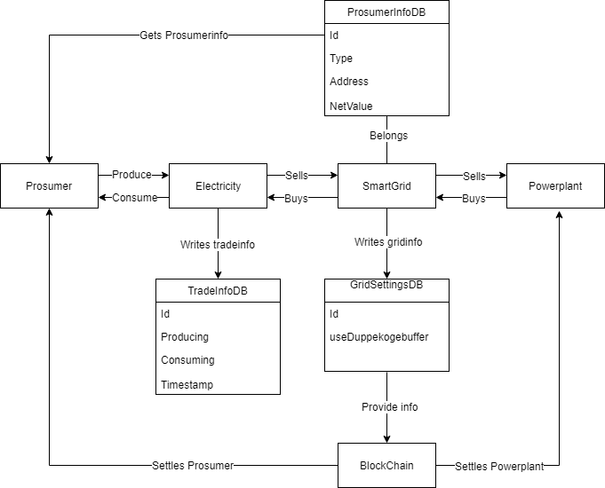
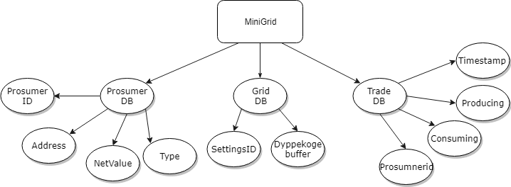
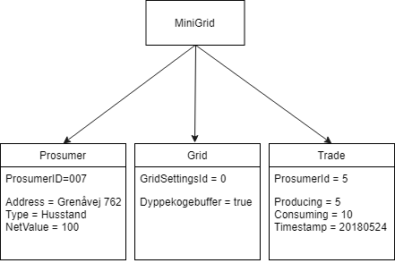
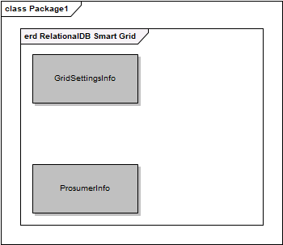
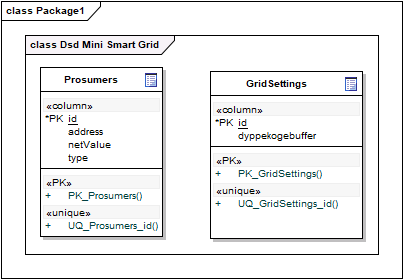
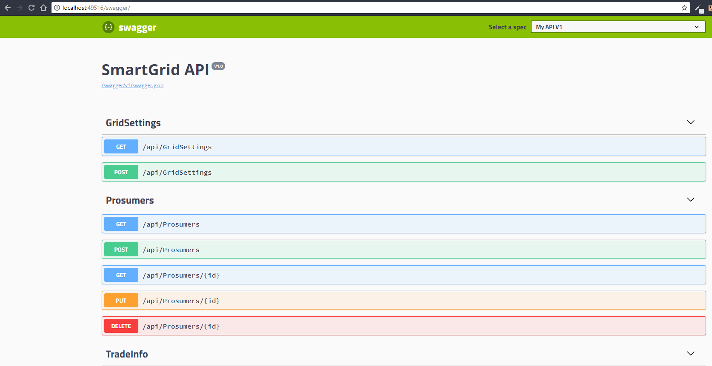
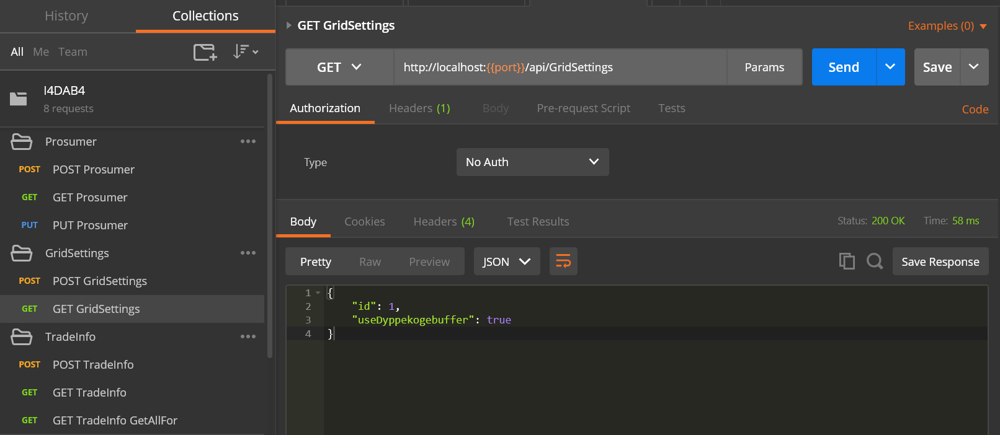

<div style="text-align: center;">

# 1. I4DAB-HandIn4

## 1.1. Group 8

<!-- Spacing -->

<br><br><br><br><br><br><br><br><br><br><br><br><br><br><br><br><br><br><br><br><br><br><br><br><br><br><br><br><br><br>

<!-- /Spacing -->

## 1.2. Participants

| Students                 | AUID     | Student number |
| ------------------------ | -------- | -------------- |
| Jakob Bonde Nielsen      | au567214 | 201607589      |
| Karsten Winther Johansen | au516160 | 201400298      |
| Kasper Juul Hermansen    | au557919 | 201607110      |
| Martin Lynge Dalgaard    | au339657 | 20112806       |

</div>

<div class="page"></div>

# 2. Table of Contents

<!-- TOC -->

- [1. I4DAB-HandIn4](#1-i4dab-handin4)
    - [1.1. Group 8](#11-group-8)
    - [1.2. Participants](#12-participants)
- [2. Table of Contents](#2-table-of-contents)
- [3. Introduction](#3-introduction)
- [4. Areas of Responsponsibility](#4-areas-of-responsponsibility)
- [5. What is Mini Smart Grid?](#5-what-is-mini-smart-grid)
    - [5.1. What is our assignment](#51-what-is-our-assignment)
- [6. Requirements specification](#6-requirements-specification)
    - [6.1. User stories](#61-user-stories)
    - [6.2. Domain analysis](#62-domain-analysis)
        - [6.2.1. Domain model](#621-domain-model)
        - [6.2.2. Aggregate diagram](#622-aggregate-diagram)
        - [6.2.3. Object diagram](#623-object-diagram)
    - [6.3. The databases](#63-the-databases)
        - [6.3.1. Smart Grid Info](#631-smart-grid-info)
        - [6.3.2. Prosumer Info](#632-prosumer-info)
            - [6.3.2.1. Entity-Relation Diagram](#6321-entity-relation-diagram)
            - [6.3.2.2. DS-Diagram](#6322-ds-diagram)
        - [6.3.3. Trader Info](#633-trader-info)
    - [6.4. Overview of Mini Smart Grid API](#64-overview-of-mini-smart-grid-api)
        - [6.4.1. api/Prosumers](#641-api-prosumers)
        - [6.4.2. api/TradeInfo](#642-api-tradeinfo)
    - [6.5. api/GridSettings](#65-api-gridsettings)
    - [6.6. The Application](#66-the-application)
    - [6.7. Unit Of Work](#67-unit-of-work)
        - [6.7.1. Repositories](#671-repositories)
        - [6.7.2. Controllers](#672-controllers)
        - [6.7.3. Start up](#673-start-up)
    - [6.8. Swagger](#68-swagger)
    - [6.9. Testing the application](#69-testing-the-application)
- [7. Discussion](#7-discussion)
- [8. Conclusion](#8-conclusion)

<!-- /TOC -->

<div class="page"></div>

# 3. Introduction

This assignment is about a microgrid which can supply energy via connections to several households. These households each is a producer and a consumer, meaning they will produce power from their renewable energy sources, and consume energy. This microgrid is only a smaller part of a larger whole and is connected to a much larger grid or connected to a powerplant where excess energy will be leveraged. Important to the microgrid is that it uses bitcoin and blockchain to handle transactions and cost of energy.

The assignment is to produce a solution which exposes an API that can display information about the microgrid, access each prosumer and handle energy transactions between each prosumer. It is required for the assignment to use three databases, one or more Relational database and one or more NoSQL database. The important part of the application is that it should supply information that will be directly used in bitcoin transactions via blockchain.

<div class="page"></div>

# 4. Areas of Responsponsibility

| Name    | Responsponsibility           |
| ------- | ---------------------------- |
| Jakob   | Prosumer Info                |
| Karsten | Smart Grid Info              |
| Kasper  | Documentation and assistance |
| Martin  | Trader Info                  |

# 5. What is Mini Smart Grid?

Mini Smart Grid is the definition of all the internal components, such as households, connection to the power plant and the mini-grid itself. Mini Smart Grid leverages the power of IoT devices to handle the flow of energy in the system. A household is both a producer and a consumer in this system, meaning that it is a prosumer. Every connection to the Minigrid can be anything from common households to complex companies. But they follow the same rule. A prosumer might produce 5 kWh every timeframe where timeframe is a relative term used to note a frame of time that captures usage energy produced and consumed in that space of time. It might also consume 3 kWh, resulting in an excess 2 kWh of energy. Another household might then via. the mini-grid create a transaction where it takes the excess 2 kWh of energy because it doesn't produce enough energy itself. And the mini-grid will then store the current netto of each connection and each transaction that has taken place, in each timeframe. If the overall system is in excess or lack of energy, it results in it creating a transaction with the connected power plant or another storage method. but, this is trivial for the system, as it calculates cost per. prosumer and can take from the power plant or other storage methods. It is important to note that each transaction will at some point result in the billing of the actual energy used or consumed from the system, this billing is handled via. bitcoin and the blockchain. For example, at the end of the month prosumer x will receive a payment equivalent of 20 kWh from prosumer y, but will have to pay the equivalent of 5 kWh to prosumer z. but, the way it works is that each household pays or receives bitcoin from the centralized Mini Smart Grid, and the last excess or lacks energy will be paid by the individual prosumer through the mini-grid.

## 5.1. What is our assignment

Our task is to produce the API that makes it possible to handle all these different prosumers and transactions. This will be done through an restAPI that is built in _`ASP.NET Core`_ with the help of _SwashBuckle - Swagger_. These APIs will leverage three databases: Smart Grid Info, Prosumer Info and Trader Info. These databases handle different tasks, such as storing Smart Mini Grid information, Prosumer information and transactions.

<div class="page"></div>

# 6. Requirements specification

## 6.1. User stories

User stories provides an overview over the funktionality an application required, which is from our point of view both the end user, prosumer and the Mini Smart Grid itself.

>1. As a user I should be able to see all the prosumers in the Mini Smart Grid.
>2. As a user I should be able to see all the prosumers transactions in the Mini Smart Grid.
>3. As a user I should be able to see the netto of all the prosumers in the Mini Smart Grid.
>4. As a prosumer I should be able to trade with the Mini Smart Grid.
>5. As a prosumer I should be able to calculate and pay the exact amount of bitcoins to the Mini Smart Grid
>6. As a Mini Smart Grid I should be able to calculate the netto of all transactions in a timeframe.

## 6.2. Domain analysis

### 6.2.1. Domain model

The following domain model is drawn to make an easy overview of the system domains. On this drawning it is possible to see who is "communicating" with who, and what they are exchanging.



At the Domain model it is shown, that the Prosumer is both producing and consuming electricity to/from the Minigrid. The Minigrid is in our system the "auctioneer", that buys and sells electricity.

- If the demand for power is bigger than the produced amount, the Grid buys from the powerplant
- If the demand is smaller than the produces amount, the grid will sell the excess amount of power.

If one of the prosumers in the grid not produces any electricity, one of the others may do, which means that there is a oputunity to buy and sell to each other in the MiniGrid. When the Trade is done, the tradeinfo is written to a DataBase, that hold the information like who bought from who, and also how big amount of power there was traded.

The SmartGrid is as mentioned before a kind of autioneer, that through the ProsumerDB knows how many and who is incuded in the Grid. It is also this DB, that holds the information about the actual netVaule or sold and bougt power.

Last but not least there is written to the SmartGridInfoDB. The message that is written has the content of the netvalue of the total Grid. This is the value that is delivered to the Blockchain as the settlement basis. The blockchain is not implemented in this sollution but it is this instance, that would havde settled the financial Statements with both the Powerplant and the prosumers.

### 6.2.2. Aggregate diagram

In this section there will be show an aggregate model. This is a model that shows a treestructure for three DataBases. The diagram also shows what the content of each aggregate is.



As show on the picture above there is three databases. These three DB's have different content but are still connected throug the ID eg. the Prusomer ID's in the Grid DB.
It is important to notice that the box named MiniGrid is not aggregate but instead the "thing" that is connecting the three DB's

### 6.2.3. Object diagram

The following diagram is called an objectDiagram. This shows an example of actual values that the attributes can be equal to.



In the example above there is a prosumer with ID 007 that buys 20 kWh from the MiniGrid. These 20 kWh are produced by one of the other Prosumers in the  grid. that the power comes from another inside the grid is shown by teh fact that the Gross In value is zerro at teh Grid object.
also in this example the Minigrid box is ddrawn to show, that this is the "thing" that is holding the system together.

## 6.3. The databases

> Insert Picture of all three databases in polyglot persistance.

The solution contains three databases, which are specified below. This application uses Polyglot persistense, meaning that the domain model is fulfilled with a number of databases, each chosen for their strengths in the specific situation.

### 6.3.1. Smart Grid Info

Smart Grid Info is a noSQL database and more specifically a Cosmos SQL API database. The database contains documents, and every document accounts for a single Smart Mini Grid system. where it contains an ID for the Smart Mini Grid and a collection of prosumers, and a total netto of all the energy transactions that has taken place in the mini grid.

### 6.3.2. Prosumer Info

Prosumer Info is a relational SQL database containing information about prosumers and stores information such as an ID for the prosumer, an address and a type. This database ties the transactions to a household and connects it to the overall smart mini grid.

#### 6.3.2.1. Entity-Relation Diagram

In this section there will be ER-diagrams for the solution. ER-Diagrams are used to descripe Relationel Databases. This means that it is only the ProsumerDB that is described with this diagram.



The diagram above shows what the Prosumer depends what the realation is and also how many of the kind that is needed. Each of the boxes on the diagrams presenting an Entity. Each of these entities can hold several attributes. Those attributes is shown in the DS-diagram

#### 6.3.2.2. DS-Diagram

The DS.diagram shows which attributes each entity have. This is shown in the example below.



At the diagram above it is shown wich attributes each entity hold. commonly for all af the entity is that they have an ID wich is the number that binds together the Database.

### 6.3.3. Trader Info

Trader Info is a noSQL database and as Smart Grid Info is a Cosmos SQL API database, where every document is a transaction between households through the mini grid.

## 6.4. Overview of Mini Smart Grid API

APIs provide an easy way for applications to utilize HTTP to connect and use a foreign system. This is especially useful for systems where end system (Client system) may be written in either a different programming language, or the API be public and the endpoint of the application. This is the way the Mini Smart Grid API is implemnted as it provides easy access to vital data, without having to bother with webpages and presentation.

### 6.4.1. api/Prosumers

- POST '/' Initializes and adds a Prosumer to the smart grid
- GET '/' Returns all the prosumers of the smart grid
- GET '/{id}' Returns a specific Prosumer from id.
- PUT '/' Edit a specific Prosumer
- DELETE '/' Delete a specific Prosumer

### 6.4.2. api/TradeInfo

'STAT': measurement from smartmeter, with information about how much a prosumer, produceses / consumes.

- GET '/' returns the smartgrids net balance (produced/consumed), on an hourly basis.
- GET '/GetAllFor/{id}' returns all STAT for the user specified by {id}.
- GET '/{yy}' returns all STAT in the year specified by {yy}.
- GET '/{yy}/{MM}' returns all STAT in the month specified by {MM} of the year {yy}.
- GET '/{yy}/{MM}/{dd}' returns all STAT in the day specified by {dd} of the month {MM} of the year {yy}.
- GET '/{yy}/{MM}/{dd}/{HH}' returns all STAT in the hour specified by {HH} of the day {dd} of the month {MM} of the year {yy}.
- POST '/' Adds a STAT.

## 6.5. api/GridSettings

- POST '/' Creates the configuration for the specific smart grid system.
- GET '/' Returns the current setting of the smart house.

## 6.6. The Application

As mentioned before, the application is written in C# with the framework ASP.NET Core 2.0, using the Web API preset. This means that the view of the MVC (Model-View-Controller) framework is a JSON or XML string (we only implemented JSON).The application handles HTTP Requests with methods, such as `POST`, `PUT`, `GET` and `DELETE`. This enables our application to follow CRUD principles (Create, Read, Update and Delete). Because we implemt these methods via HTTP requests, our controller has to stay stateless. We provide all of these utilities so that the user can safely access data stored in the three databases. 

## 6.7. Unit Of Work

A Unit of work is a design pattern that enables the application to accomplish a bit of work, before creating a transaction with whatever persistance is connected to the application and more specifically the Unit of Work. This application contains our three databases and is initialized at every requests, to serve a fresh Unit of Work with a fresh track listing.

<!-- Replace with fresh listing -->

```csharp
public class UnitOfWork : IDisposable, IUnitOfWork
{
    private readonly DocumentClient _client;
    readonly string _host = "{hidden}";
    readonly string _key = "{hidden}";
    readonly string _dbname = "TraderInfo";
    readonly string _collection = "TestCollection";
    private readonly Uri _collectionUri;
    private TradesRepo _tradesRepo;

    public TradesRepo TradesRepo => this._tradesRepo ?? new TradesRepo(_client, _collectionUri);

    private bool disposed = false;

    public UnitOfWork()
    {
        try
        {
            _client = new DocumentClient(new Uri(_host), _key);
            _client.CreateDatabaseIfNotExistsAsync(new Database() { Id = _dbname }).Wait();
            _client.CreateDocumentCollectionIfNotExistsAsync(UriFactory.CreateDatabaseUri(_dbname),
                new DocumentCollection { Id = _collection }).Wait();
            _collectionUri = UriFactory.CreateDocumentCollectionUri(_dbname, _collection);
        }
        catch (Exception e)
        {
            Console.WriteLine("No cosmosDB emulator found at " + _host);

            Console.WriteLine(e);
            throw;
        }
    }

    protected virtual void Dispose(bool disposing)
    {
        if (!this.disposed)
        {
            if (disposing)
            {
                _client.Dispose();
            }
        }
        this.disposed = true;
    }

    public void Dispose()
    {
        Dispose(true);
        GC.SuppressFinalize(this);
    }
}
```

As shown above, our UnitOfWork handles the inialization of Repositories and the DocumentDB collections. It's important to note, that as the garbage collector can't deallocate unmanaged memory, we have to Implement the IDisposable interface,which gives the application the oppertunity to manually specify how to handle unmanaged memory, such as our `DocumentClient _client`. This Unit of Work exposes `TradesRepo` and `TOBEADDED!!!!` which is our interface to the DocumentDBs and these Repositories exposes the required **CRUD** methods.

Unit of Work implementes the `Save()` method, which is the whole reason why Unit of Work is used. The save method, tells all the contexts that they should push their transactions to the Databases.

### 6.7.1. Repositories

The Repository pattern is a pattern that creates a facade between a collection and the program, this enables the developer to force the other developers to access the collections through fixed methods, that contains methods, that are set to provide safe access to data.

To limit the amount of work required, Generic Repositories are implemented, these are abstract classes that implement common functuality that could be overritten when implementing the more specialized Repositories. This also reduces code dublication, as many Databases required nearly identical access conditions.

Because we use different types of databases, that are vastly different we've implemented a `GenericDocumentRepo` and a `Repository`. These are vastly different in implementation, but the idea is the same, expose CRUD methods in different formats and encapsulate collections. These methods, doesn't contain any way of persist the data. This is instead done in the Unit of Work pattern. 

```csharp
public class Repository<T> : IRepository<T> where T : class
{
    private readonly DbContext context;
    private DbSet<T> entities;

    public Repository(DbContext context)
    {
        this.context = context;
        entities = context.Set<T>();
    }

    public IEnumerable<T> GetAll()
    {
        return entities.AsEnumerable();
    }

    public T Get(long id)
    {
        return entities.Find(id);
    }

    public void Insert(T entity)
    {
        if (entity == null)
        {
            return;
        }
        entities.Add(entity);
        context.SaveChanges();
    }

    public void Update(T entity)
    {
        if (entity == null)
        {
            return;
        }
        entities.Update(entity);
    }

    public void Delete(T entity)
    {
        if (entity == null)
        {
            throw new ArgumentNullException("entity");
        }
        entities.Remove(entity);
        context.SaveChanges();
    }
}
```

As seen above, the context provides easy access to the database, and the context itself can actually be considered a Repository itself. However, it is still legal, for us to implement a Repository on top of the context as we need a way to provide utility to the context itself, such as validation, error handling and relational includes, which isn't relevant for the Mini Smart Grid application, but is very useful in other context.

> `GenericDocumentRepo` is also important, but as it is quite a bit longer, we'll omit it from the rapport, however, it can be viewed in the solution.

### 6.7.2. Controllers

> Insert MVC picture

Controllers are a vital part of the application, it is in practice the thing that serves all the data and connects the models to the views and presents it to the end user.

```csharp
// GET: api/Prosumers/5
[HttpGet("{id}")]
public async Task<IActionResult> GetProsumer([FromRoute] string id)
{
    if (!ModelState.IsValid)
    {
        return BadRequest(ModelState);
    }

    var prosumer = await _context.Prosumers.SingleOrDefaultAsync(m => m.Address == id);

    if (prosumer == null)
    {
        return NotFound();
    }

    return Ok(prosumer);
}
```

This code snippet is from the ProsumerController and is a GET method that returns a prosumer with a specific ID. This is one of 5 methods usually implemented: GET, Get all, POST, PUT and DELETE. Controllers provide a way for us to route requests to a specific URL in this case `/api/Prosumers/{id}`.

### 6.7.3. Start up

Start up is probably the most important part of an ASP.NET Core application, it is the middleware that binds it all togeather. It contains a Method called `ConfigureServices()` that enables easy access to DI (Dependency Injection) and `Configure()` which the request pipeline.

```csharp
public void ConfigureServices(IServiceCollection services)
{
    services.AddMvc();
    services.AddSwaggerGen(c => { c.SwaggerDoc("v1", new Info
    {
        Title = "SmartGrid API", Version = "V1.0"
    }); });

    services.AddScoped<IProsumerRepository, ProsumerRepository>();
    services.AddScoped<IUnitOfWork, UnitOfWork>();
}

public void Configure(IApplicationBuilder app, IHostingEnvironment env)
{
    if (env.IsDevelopment())
    {
        app.UseDeveloperExceptionPage();
    }
    app.UseSwagger();
    app.UseSwaggerUI(c =>
    {
        c.SwaggerEndpoint("/swagger/v1/swagger.json", "My API V1");
    });
    app.UseMvc();
}
```

There are two important things to take note of: Swagger is generated and is provided to gain an overview and validation over the implemented APIs, next is the `services.AddScoped` method, which enables DI on every request.

## 6.8. Swagger

Swagger is a site that runs on an application and listens for the url '/Swagger' it is useful for gaining an overview of the API's that an application can expose. The framework will expose and enable easy testing and documentation for API's that are usually need to know or hidden.



## 6.9. Testing the application

To test this application we have decided to create a setup with POSTMAN. Postman is an excellent free app, that gives the ability to easily test endpoints and then record the output. Postman makes it easy to create presets for future use, and can even mock itself, so that it functions like an API / system tester.



As shown in the video, this application makes it very easy to test an application where the interface is the API.

# 7. Discussion

In this assignment we've explored polyglot persistance, and the utility it can provide when having to split persistence to more than one persistence option. It has given insight into how effecient it is to use Unit of Work pattern and Repository patterns to give access to the different types of context, but still using them the same way. The development has given insight into how and when to use a noSQL database and when to use a relational. We've chosen to implement two noSQL Cosmos dbs and one Relational SQL db. Overall the understanding regaring having three different context has provided a way to seamlessly integrate different functionality, that can easily be modelled via. DDD, even if they have very different areas of responsibility.

# 8. Conclusion

We succeeded in creating an application Smart Mini Grid, which could handle lots of different prosumers, and their individual transactions. We then proceeded to able to pull the records to watch the final calculations and what the individual prosumer either owned or should be paid. All of this was handled with a clever netto in and out system with the Mini grid, where each prosumers payment went to and from the grid. All in all it succeded using polyglot persistence to use multiple databases to handle a fairly complex domain model.